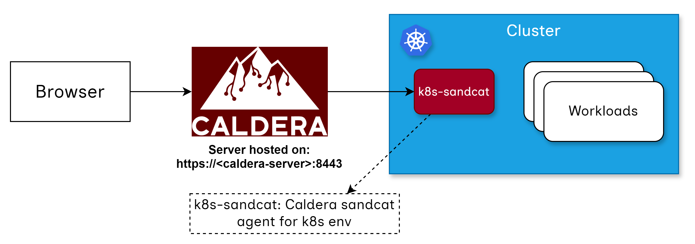

# KubeBreach

* Emulating breaches in Kubernetes
* Adversarial Emulation for k8s workloads

# High Level Architecture

* [Caldera-Server](https://github.com/mitre/caldera): Orchestrator for the attacks
* [K8s-Sandcat](https://github.com/accuknox/k8s-sandcat): Caldera Sandcat agent for k8s environment. Packages all the k8s tools along with [MITRE Caldera Sandcat](https://github.com/mitre/sandcat) to drive k8s related adversarial accesses.

# Emulating Adversarial behaviour in k8s workloads

## Hashicorp Vault

